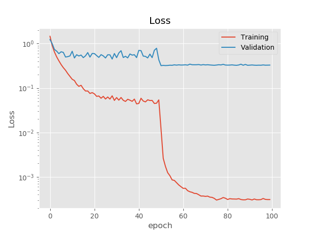
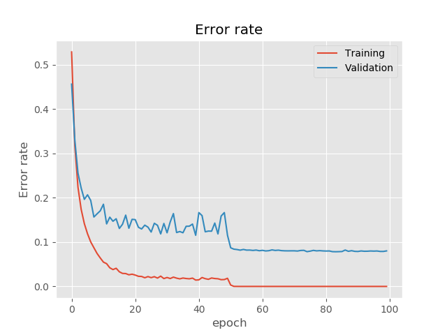

# [Deep Residual Learning for Image Recognition(ResNet)](https://arxiv.org/abs/1512.03385)


<p>
The repositroy training a ResNet model on Cifar10 Dataset, and could be rewrited easily for ImageNet.
    
Many modern Deep Learning paper in computer vision domain is based on and imporved by ResNet. such as wide-ResNet, ResNext, DenseNet, TResNet, yolov3. The epoch-marking improvement inspires researchers and many existed task-oriented model, image segmentation and image detection could be remade by residual machanism to build a deeper, easy-trained model. Rather than larger model parameters, exquisite but simple machanism with mathematic assumption makes the Deep Learning much better. After importing [Making Convolutional Network Shift-Invariant Again](https://arxiv.org/abs/1904.11486) and [Inplace ABN](https://arxiv.org/abs/1712.02616), ResNet could be trained in single 1080ti GPU with 11 GiB, larger mini-batch size and larger input size scale and deeper model parameters.
</p>

## Dependency : 
<ol>
    <li>pytorch 1.4.0</li>
    <li>torchvision 0.5.0</li>
    <li>numpy</li>
    <li>tqdm</li>
    <li>[InPalce ABN](https://github.com/mapillary/inplace_abn) </li>
</ol>

## Usage

```
usage main.py [--batch_size N][--learning_rate Float][--weight_decay Float][--momentum Float]
              [--cuda N][--log PATH][--preceed Boolean][--training_epoch N]

optional arguments:
    --batch_size               default=64,                traing and testing batch size
    --learning_rate            default=1e-1,              optimizer learning rate
    --weight_decay             default=1e-4,              optimizer L2 penalty
    --momentum                 default=0.9,               optimizer momentum
    --cuda                     default='0',               GPU Index for training
    --log                      default='../result/log',   tensorboard log directory
    --preceed                  default=False,             whether load a pretrain model
    --training_epoch           default=300,               total training epoch

```

## Implement Results
<table>
  <tr>
      <td><h2>Loss</h2></td>
      <td><h2>Error rate</h2></td>
  </tr>
  <tr>
      <td></td>
      <td></td>
    </tr>
</table>